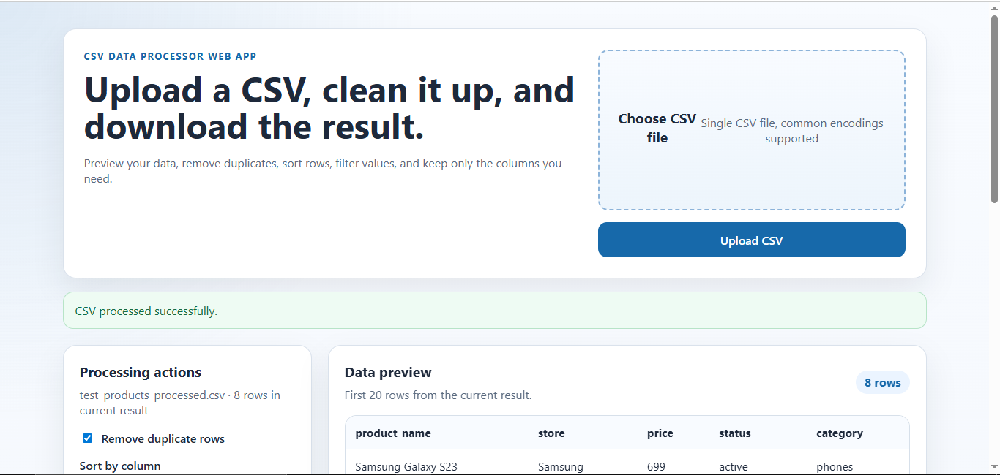

# CSV Data Processor Web App

## Project overview
CSV Data Processor Web App is a small fullstack tool built for portfolio use. It lets a user upload a CSV file, preview the data, apply a few practical transformations, and download the processed CSV file.

The project is intentionally simple: no database, no authentication, no external APIs, and no frontend framework. The focus is on clean backend logic, file handling, data processing, and a polished browser UI.

## Preview



## Features
- Upload a single CSV file
- Validate missing, invalid, and empty uploads
- Preview the first 20 rows of the uploaded data
- Remove duplicate rows
- Sort by a selected column in ascending or descending order
- Filter rows by substring match in a selected column
- Keep only selected columns
- Download the processed CSV result
- Handle header-only CSV files without crashing
- Show clear error messages in the UI

## Tech stack
- Python
- FastAPI
- Jinja2 templates
- pandas
- HTML
- CSS
- Vanilla JavaScript

## Project structure
```text
csv-data-processor-web-app/
├─ main.py
├─ csv_service.py
├─ schemas.py
├─ requirements.txt
├─ README.md
├─ .gitignore
├─ templates/
│  └─ index.html
├─ static/
│  ├─ styles.css
│  └─ app.js
├─ uploads/
│  └─ .gitkeep
└─ tests/
   └─ test_csv_service.py
```

## Setup
Requirements:
- Python 3.11+
- pip

Create a virtual environment and install dependencies:

```powershell
py -m venv .venv
.venv\Scripts\activate
py -m pip install -r requirements.txt
```

## Run locally
Start the development server:

```powershell
py -m uvicorn main:app --reload
```

Then open:

```text
http://127.0.0.1:8000
```

Run tests:

```powershell
py -m pytest
```

## API endpoints
- `GET /`
  - Render the main page
- `POST /api/upload`
  - Upload a CSV file and return a preview
- `POST /api/process`
  - Apply processing rules to the current CSV session
- `GET /api/download?job_id=...`
  - Download the current processed CSV file

## CSV processing rules
- Only `.csv` files are accepted
- Empty files return a validation error
- Header-only CSV files are valid and return an empty preview
- Common CSV formats are supported with automatic delimiter detection
- The app tries common encodings: `utf-8-sig`, `utf-8`, and `cp1251`
- Processing is recalculated from the original uploaded file on every request
- Operations run in this order:
  1. Remove duplicates
  2. Filter rows
  3. Sort rows
  4. Keep selected columns

## Limitations
- The app stores temporary processing files on the local filesystem
- Uploaded files are not cleaned up automatically in this version
- The app is designed for a simple single-process local setup
- Large CSV files are not optimized for streaming or background processing
